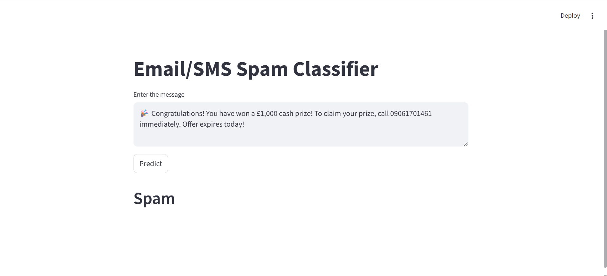

# 📩 SMS Spam Classifier

A machine learning project that classifies SMS/Email messages as **Spam** or **Not Spam (Ham)** using Natural Language Processing (NLP) and a Multinomial Naive Bayes classifier.

The project includes a complete machine learning pipeline from text preprocessing and feature extraction to model training and deployment through a Streamlit web application.

## 🚀 Application Preview



The application allows users to enter a message and instantly receive a prediction indicating whether the message is **Spam** or **Ham**.

## 🎯 Project Objective

The goal of this project is to build a text classification system capable of identifying unwanted or fraudulent SMS messages using machine learning and NLP techniques.

## 🛠️ Technologies Used

- Python
- Pandas
- NumPy
- Scikit-learn
- NLTK
- Streamlit
- Jupyter Notebook

## 🔍 Machine Learning Workflow

The project follows these main steps:

1. Data loading and exploration
2. Text preprocessing
3. Lowercasing
4. Tokenization
5. Removal of punctuation and non-alphanumeric characters
6. Stopword removal
7. Stemming using Porter Stemmer
8. TF-IDF feature extraction
9. Train-test split
10. Model training and evaluation
11. Saving the trained model and vectorizer
12. Deployment using Streamlit

## 🤖 Machine Learning Model

The final application uses **Multinomial Naive Bayes (MultinomialNB)** for SMS classification.

The model is trained on TF-IDF-transformed text data and saved using Python Pickle so that the trained model can be reused directly by the Streamlit application.

### Model Performance

On the test set, the Multinomial Naive Bayes model achieved approximately:

- **Accuracy:** 97.10%
- **Precision:** 100%

These results are based on the evaluation performed in the project notebook.

## 📂 Project Structure

```text
SMS-Spam-Classifier/
│
├── app.py
├── model.pkl
├── vectorizer.pkl
├── sms-spam-detection.ipynb
├── spam.csv
├── requirements.txt
├── README.md
└── app-screenshot.png
